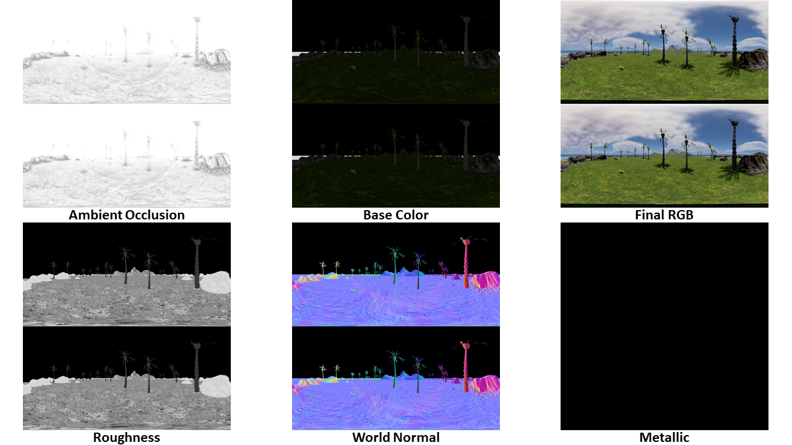
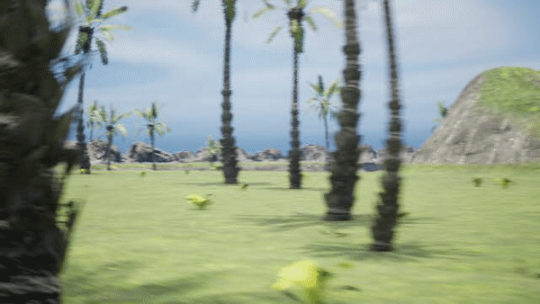
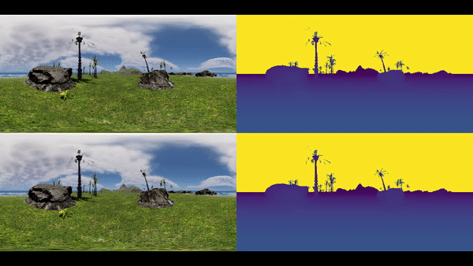

# UE5_360Camera
This is a Stereo 360 Camera on UE5.
 
It can generate:
Mono/Stereo equirectangular image in:
- Final Color
- Base Color
- Roughness
- Scene Depth
- World Normal
- Metallic
- Ambient Occlusion

## Examples
The data was generated in a self-built island scene.
 
 
**Data Examples**

**Video Clip**

Front camera captured video clip (50 frames).

**Equirectangular Image/Video in RGB & Depth**

